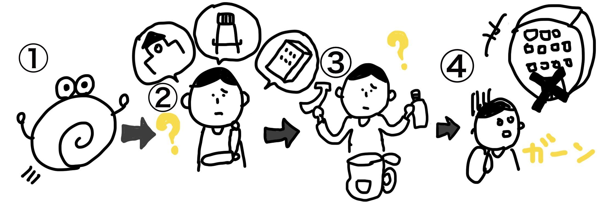
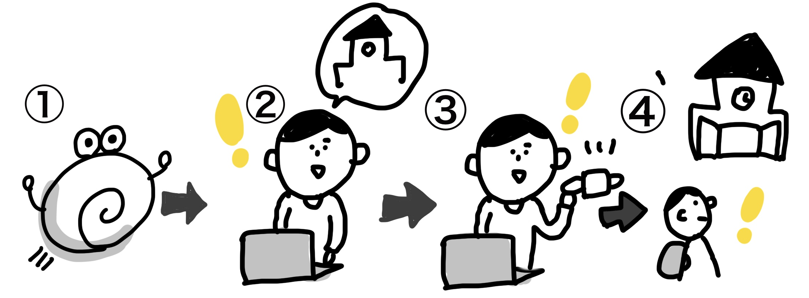

# KainoMe

## 製品概要
### 避難所 X Tech

### 背景
「災害時には早めの避難を心がけ、自分や大切な命を守ってほしい。」
>近年、台風をはじめとする様々な災害が各地で起こっています。命を守るためにも普段と違う前兆を感じたらすぐに避難するべきと言われていますが、実際はどうでしょうか。いつどこに避難すべきか分からないと感じている人は意外と多いのが現状です。また、実際に避難所へ向かってみると建物の中はすでに人で溢れおり、他の避難所への移動を余儀なくされる人もいます。この問題をふまえ、我々は近隣の避難所の状況を把握することが出来るアプリケーションを開発しました。

### 製品説明
KainoMeは近隣の避難所に来た人数とCO₂濃度を読み取り、その建物内にどれだけの人が流入しているかを表示してくれるアプリケーションです。
> 
> 〈今までの流れ〉
1. 台風による大雨の影響で川が氾濫しそう！避難所へ避難することを決意。
2. いつどこへ避難すべきなのか分からない。
3. 何を持っていくべきなのか迷う。
4. いざ避難所へ向かうも、受け入れ不可。他の避難所へ移動。
5. 避難者の把握は手作業。
> 
> 〈KainoMe使用の流れ〉
1. 台風による大雨の影響で川が氾濫しそう！
2. アプリを起動させ、近くの避難所の混雑状況や物資情報を確認。
3. 避難に必要なモノの準備。
4. 避難できそうな場所へ早めに避難。
5. 避難人数が自動的に把握される。

### 特長

#### 1. 人の検知
避難所の出入口にカメラを設置。OpenCV(顔認識システム)により人の流入を検知し、アプリに情報を送る。
> 

#### 2. CO₂濃度の検知
Netatmoウェザーステーションを避難所に設置し、CO₂濃度情報をアプリへ送る。濃度に応じてアプリ内の顔のマークが変化する。顔のマークの種類は3種類程度。
> 

#### 3. 避難所の各情報
避難所にどんな物資，設備があるかを情報提供する。

### 解決出来ること
1. 災害時に避難所にいる人数をアプリから把握することで、自分がどの避難所へ向かえばいいのかがわかる。
2. アプリ内の物資情報から自分が持ち出すべきものが分かり、スムーズな避難が可能になる。

### 今後の展望
足立区の避難所と提携し、そこにOpenCV、NETATMOウェザースターションを設置します。実際にアプリケーションを使ってもらい実用可能性を検証し改善します。ユーザのフィードバックを得てブラッシュアップし、よりスムーズな避難行動を促すアプリケーションを目指します。

## 開発内容・開発技術
### 活用した技術
#### API・データ

* [Netatmo](https://dev.netatmo.com/resources/technical/reference/weatherapi)
* [Google Maps Pratform](https://cloud.google.com/maps-platform/?hl=ja)

#### フレームワーク・ライブラリ・モジュール
* [Node.js](https://nodejs.org/ja/)
* [Expres](https://expressjs.com/ja/)
* [OpenCV](https://opencv.org/)

#### デバイス
* ノートPC
* [ELECOM UVC WEB カメラ UCAM-C310FBBK](https://www.elecom.co.jp/products/UCAM-C310FBBK.html)
* [Netatmo Weather Station](https://www.netatmo.com/en-gb/weather/weatherstation)

### 独自開発技術（Hack Dayで開発したもの）
#### 2日間に開発した独自の機能・技術
* webアプリUI(マップ画面，詳細ページ)
* CO2濃度[ppm]と人数推定値のセンシング
* CO2濃度と人数推定値をwebに反映
* 他ユーザとの位置情報共有
* ロゴ，アイコンなどのマテリアル

参考文献：
[COとCO2濃度の人体への危険度に関して](https://www.san-eee.com/measuring/co%E3%81%A8co2%E6%BF%83%E5%BA%A6%E3%81%AE%E4%BA%BA%E4%BD%93%E3%81%B8%E3%81%AE%E5%8D%B1%E9%99%BA%E5%BA%A6%E3%81%AB%E9%96%A2%E3%81%97%E3%81%A6/)
